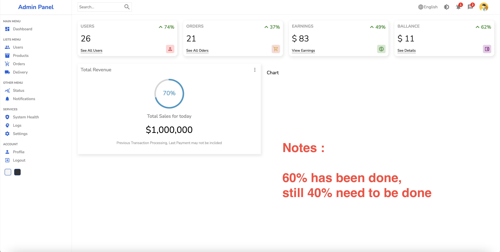

## Ivandjoh-AdminPanel

### About

This is my own new project which I will continue to develop for my personal benefit. This project was created using `npx create-react-app`

### Getting Started

To start developing this project, simply clone it by access the url's repository by typing  

- `git clone https://github.com/ivandi1980/ivandjoh-admin-panel.git` into your local machine.
- `npm install`
- `npm start`

### ScreenShoot

### Notes

This project is still in `Development phase` so this Document will continue to receive updates!
